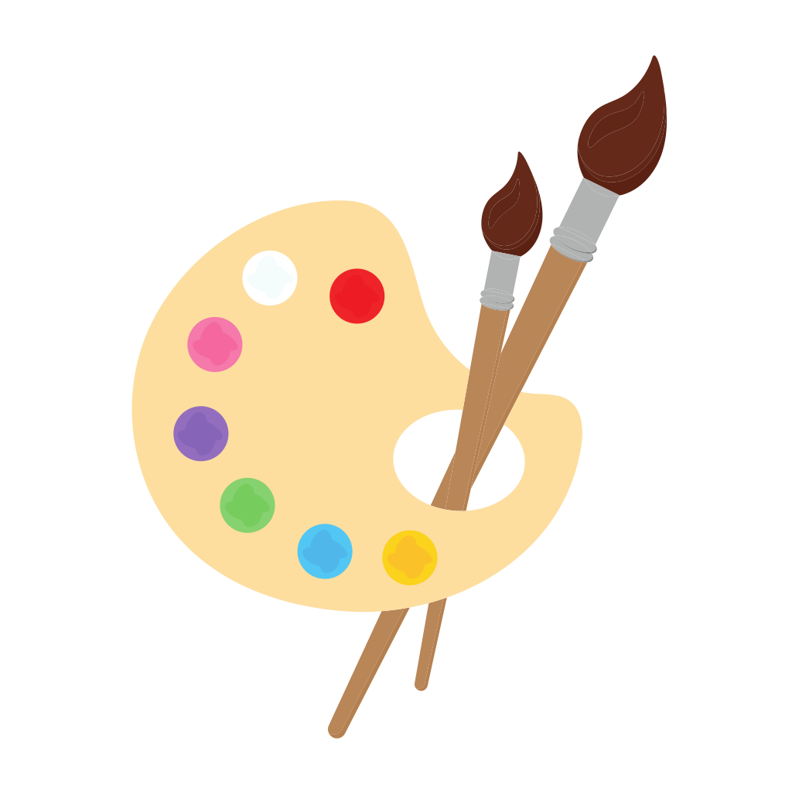

  
  <h1>🎨 ArtGallery</h1>
  
<em>Aplicación iOS desarrollada para el reto final del programa iOS Developer del Tecnológico de Monterrey.</em>

---

## 📸 Galería de la App

  <table>
    <tr>
      <td align="center"></td>
      <td align="center"></td>
      <td align="center"></td>
      <td align="center"></td>
    </tr>
    <tr>
      <td align="center"><i>Pantalla Principal (Galería)</i></td>
      <td align="center"><i>Vista Detallada de Obra</i></td>
      <td align="center"><i>Zoom Interactivo (Pellizco)</i></td>
      <td align="center"><i>Gráficas Financieras</i></td>
    </tr>
  </table>

---

  
   
  <i>▶️ Haz clic en la imagen para ver el video demostrativo de la app en YouTube</i>

---

## 👨‍💻 Sobre el Proyecto

**ArtGallery** es una aplicación nativa para iOS diseñada para visualizar, interactuar y administrar una colección de obras de arte. Se destaca por una interfaz moderna, fluida y altamente reactiva, pensada para ofrecer una experiencia premium apegada a las **Apple Human Interface Guidelines**.

> [!NOTE]
> **Contexto del Reto:** Este proyecto fue elaborado de acuerdo a los requerimientos del reto del programa **iOS Developer del Tecnológico de Monterrey**. La aplicación incluye navegación avanzada, manipulación de vistas con gestos y visualización de datos estadísticos usando Swift Charts, evaluando competencias de diseño responsivo y arquitectura SwiftUI.

---

## 🛠️ Tecnologías y Herramientas

  
  
  
  
  

---

## 🏗 Arquitectura y Detalles Técnicos

La aplicación está construida utilizando **SwiftUI**, garantizando un flujo de datos reactivo y un código altamente mantenible con un fuerte enfoque en el diseño de interfaces escalables.

### 📁 Jerarquía de Archivos

- **`ObraDeArte.swift`**: Contiene el modelo de datos principal (`ObraDeArte`) y el arreglo de obras predeterminadas (`galeriaObras`). Implementa el protocolo `Identifiable` para su fácil integración en las vistas.
- **`ContentView.swift`**: La vista raíz que implementa un `TabView` para navegar entre la sección de galería y la sección de gráficas.
- **`VistaGaleria.swift`**: Implementa una interfaz de tarjetas de borde a borde (*edge-to-edge*) con superposiciones de gradientes. Incluye un buscador (`.searchable`) integrado de manera nativa para filtrar obras por título o autor.
- **`ObraVistaDetalle.swift`**: Una vista detallada y elegante que muestra información curatorial y el valor de la pieza. Utiliza `GeometryReader` y gestos de ampliación (`MagnificationGesture`) para permitir al usuario hacer zoom detallado en las pinturas manteniéndolas centradas.
- **`GraficaGaleria.swift`**: Integra el moderno *framework* `Charts` de Swift para mostrar un historial de ingresos y egresos a través de gráficos de línea atractivos y responsivos, con colores y leyendas automáticas.

### ✨ Features Principales

- **Gestión de Galería:** Explora una colección cuidadosamente curada con una UI premium.
- **Búsqueda Dinámica:** Filtra rápidamente las obras de arte disponibles en tiempo real.
- **Interacción Multitáctil:** Inspecciona de cerca cada pincelada usando doble toque o gestos de pellizco en la vista de detalles.
- **Estadísticas Visuales:** Visualiza de forma clara el desempeño financiero de la galería mediante gráficos dinámicos integrados con *Swift Charts*.
- **Diseño Adaptativo:** Uso de *safe areas* correctas, gradientes sutiles y máxima legibilidad sin textos cortados, asegurando que el contenido sea siempre el protagonista.
